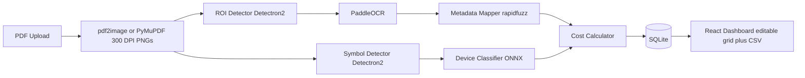

# Architecture

## Overview

A two-branch computer-vision pipeline runs over the same page images rendered
from an uploaded HVAC layout PDF. One branch handles unstructured text
(title-block metadata), the other structured symbols (device counting). Both
consolidate into a costed, editable report.

## Pipeline stages (backend/ml/)

| Stage | Module | Mock backend | Real backend |
| --- | --- | --- | --- |
| Requirement extract | `requirement_extractor.py` + `requirement_pdf.py` | n/a (always real) | PyMuPDF text + heuristics → `<name> requirement.pdf` |
| PDF -> images | `pdf_to_image.py` | n/a (always real) | pdf2image (poppler) with automatic PyMuPDF fallback; truncates at `max_pdf_pages` |
| Title-block ROI | `roi_detector.py` | right-hand sheet strip | Detectron2 Faster R-CNN |
| OCR | `ocr.py` | canned title-block lines | PaddleOCR (en) |
| Metadata mapping | `metadata_mapper.py` | n/a (always real) | rapidfuzz alias matching |
| Symbol detection | `symbol_detector.py` | seeded pseudo-random boxes | Detectron2 Faster R-CNN |
| Classification | `classifier.py` | crop-hash label | timm CNN exported to ONNX |
| Costing | `cost_calculator.py` | n/a (always real) | count x rate-table join |

Requirement extraction runs on the **full PDF text** before page rendering. Output is
written to `storage/requirements/<stem> requirement.pdf` and exposed via
`GET /api/projects/{id}/requirement.pdf`. Batch CLI:
`python scripts/extract_requirements.py <folder>`.

`pipeline.py::run_pipeline` orchestrates the stages; `process_project` wraps it
as a FastAPI background task with status tracking (`pending -> processing ->
done | failed`) persisted on the project row so the frontend can poll.

## The mock/real model swap

Every model wrapper implements a tiny Protocol from `ml/base.py`
(`RoiDetector`, `SymbolDetector`, `DeviceClassifier`, `OcrEngine`) and is
constructed through a factory (`get_roi_detector(settings)` etc.) that picks
the backend from `HVAC_USE_MOCK_MODELS`:

- **Mock backends** are deterministic (seeded from image content), dependency
  free, and produce realistic shapes of data — so the pipeline, API, database,
  tests, and dashboard are fully exercised without any trained weights.
- **Real backends** lazily import their heavy dependencies (detectron2,
  paddleocr, onnxruntime) inside `__init__` and raise a descriptive
  `ModelNotAvailableError` if deps or weight files are missing. Nothing else
  in the codebase changes when switching.

This was a deliberate POC decision: Detectron2 has no Windows wheels and the
paddle stack is heavy, so the default install stays light while the real
integration points are already written and unit-testable.

## Metadata mapping design

Title blocks vary across drawing templates ("Client" vs "Owner", "Engineer" vs
"Consultant", combined "Architect / Engineer" cells, OCR noise like "CL1ENT").
`metadata_mapper.py` therefore avoids per-field regexes:

- A canonical schema (`title`, `client`, `architect`, `engineer`,
  `project_address`, `due_date`) maps to alias lists (`FIELD_ALIASES`).
- OCR lines are parsed in two layouts: inline (`CLIENT: ACME`) and stacked
  (label line followed by value line).
- Labels are fuzzy-matched against aliases with two rapidfuzz tiers:
  token-set ratio >= 85 (word order / extra words, enables combined labels to
  hit multiple fields) or plain character ratio >= 80 (OCR typos).
- Candidate labels must be short (<= 3 words) so value lines such as company
  names are never mistaken for labels; first match wins per field; dates are
  normalized to ISO across common formats.

Supporting a new template is a data change (extend `FIELD_ALIASES`), not a
code change.

## Data model (SQLite via SQLAlchemy)

- `Project` — upload + status + error message + extracted metadata columns.
- `Page` — rendered page image paths (debugging / future overlay UI).
- `DeviceLine` — costed line item. Editable `count`/`unit_cost` sit next to
  immutable `detected_count`/`default_unit_cost`, so manual overrides are
  visible and reversible in the UI; `needs_review` flags devices missing from
  the rate table.

Totals are always computed server-side from current line values. Manual
overrides are validated strictly: non-negative, capped at sanity limits
(100,000 per count, 10,000,000 per unit cost), and `Infinity`/`NaN` are
rejected (`allow_inf_nan=False`) so they can never poison a total. The same
caps are mirrored client-side in the editable grid.

### Known limitation: money as float

Costs are stored as Python floats / SQLite `REAL` with a consistent
round-to-2-decimals discipline at the line and grand-total level. That is
adequate for this POC, but production invoicing should switch to integer
cents or `Decimal` (SQLAlchemy `Numeric`) to eliminate floating-point
representation drift entirely.

## API surface

| Method & path | Purpose |
| --- | --- |
| `POST /api/upload` | Validate + store PDF, create project, start background processing |
| `GET /api/projects` | List projects with status |
| `GET /api/projects/{id}` | Full detail: metadata, device lines, grand total |
| `PATCH /api/projects/{id}/lines/{line_id}` | Override count/unit cost, returns refreshed detail |
| `DELETE /api/projects/{id}` | Remove project + stored files |
| `GET /api/projects/{id}/report` | Consolidated report JSON (409 until done) |
| `GET /api/projects/{id}/report/csv` | CSV export |

## Frontend

React 18 + TypeScript (strict) + Vite + Tailwind. React Query owns server
state: the project detail query polls every 1.5 s while status is
pending/processing; the line-override mutation writes the server's refreshed
project straight into the query cache. The costing grid is TanStack Table
with editable count/unit-cost cells (commit on blur/Enter, reset links back to
detected values). Vite proxies `/api` to the backend, so no CORS config is
needed in dev (the backend still allows localhost:5173 explicitly).

## Training (future work — needs annotated data)

- Annotate page images in **Label Studio** (runs locally): title-block boxes
  for the ROI model, symbol boxes for the detector, cropped-symbol labels for
  the classifier. Export COCO into `ml-training/data/`.
- `backend/scripts/train_roi_detector.py` / `train_symbol_detector.py`
  fine-tune COCO-pretrained Detectron2 Faster R-CNN models; log runs with
  file-based **MLflow** (`./mlruns`).
- `backend/scripts/export_model.py` exports the timm classifier to ONNX with
  the exact class order of `ml/classifier.py::DEVICE_TYPES`.
- Drop outputs into `backend/models/`, flip `HVAC_USE_MOCK_MODELS=false`.
